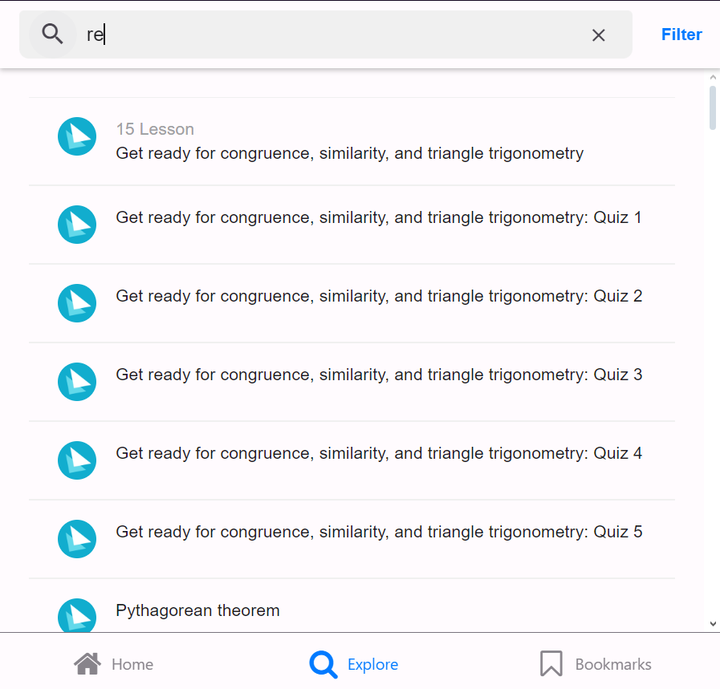
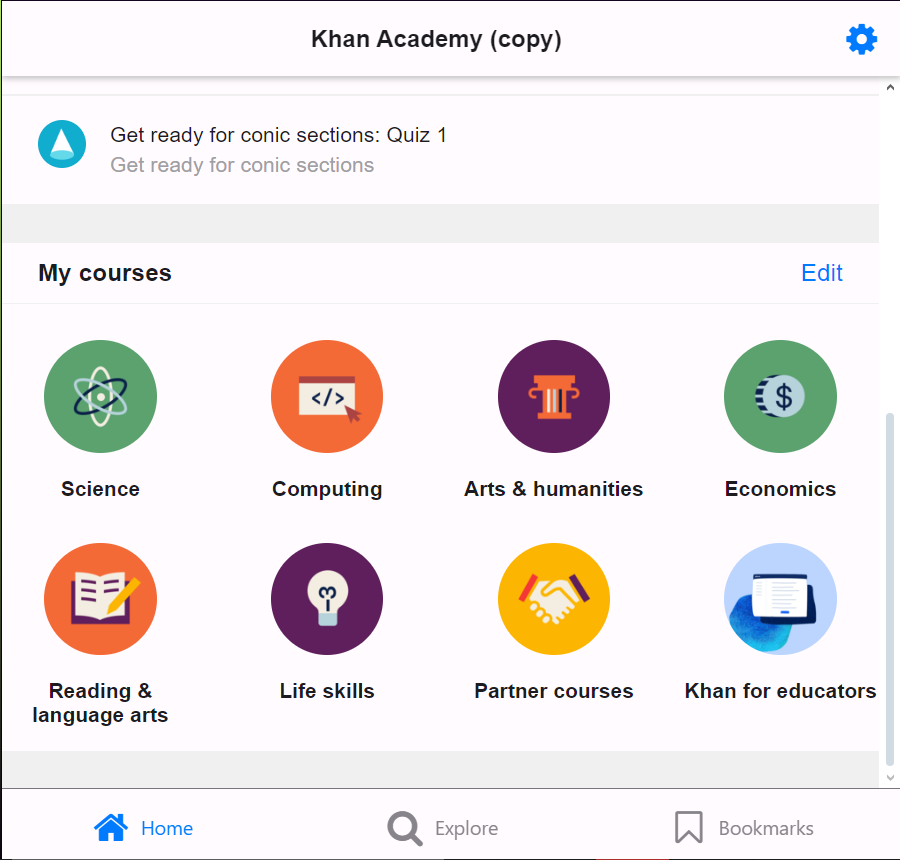

## Welcome To khanAcademyProject

    

this is a project for mid semester of Cross-Platform Programming class in Multimedia Nusantara University (UMN), it copies the front page of [KhanAcademy](https://play.google.com/store/apps/details?id=org.khanacademy.android&hl=en_CA) mobile app (version: `8.2.0 (103582) v10`).

## About Project

this project is made using **react-native typescript**

### References

<h3 style="text-align: center;">Real App Preview* </h3>

|||||
|:---:|:---:|:---:|:---:|
|||||

<h3 style="text-align: center;">Copied App Preview* </h3>

|||||
|:---:|:---:|:---:|:---:|
|||||
|||||

\* these pictures can be found in `/screenshots` directory

### The Project Directories

- `components`: all the reusable components
- `pages`: list of pages, nav is considered as one page
- `styles`: custom stylesheet used in the project
- `redux` : all the shared state management variables
- `routes`: shared routes and parameters

### Libraries Used

- `@expo/vector-icons`: for material icons
- `@react-navigation` : for bottom bar navigation
- `react-redux`       : state management
- `react-native-paper`: styling and dark mode
- `react-native-safe-area-context`: for safe area padding
- `@react-native-async-storage/async-storage`: for dark mode preference

### My Profile

name: Chrealvin

NIM : 00000045606
